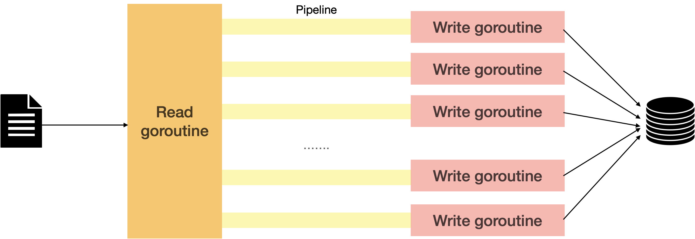

# rock_data
Process rock song play data and import it to postgreSQL DB.

## design 


## build
```
go build -o ./rock_data .
```

## run
```
./rock_data -file ./data.csv
```

## configuration
- config.toml
1. pipelineNumber - the number of pipeline, define the number of write goroutines.
2. pipeCapacity - the capacity of each pipeline.
3. debugSwitch - the switch to print detail log.
4. database.maxMultiInsertNumber - I use multi-insert to improve efficiency, this field controls max multi-insert number.

## postgreSQL schema
```postgresql
CREATE USER jane WITH PASSWORD ‘asdf’;

CREATE DATABASE classic_rock WITH ENCODING 'UTF8' OWNER='Jane';

\c classic_rock;
SET ROLE jane;

Create schema data;
Create table data.play_record (
id serial primary key,
song_raw text not null default '',
song_clean text not null default '',
artist_raw text not null default '',
artist_clean text not null default '',
callsign text not null default '',
time timestamp with time zone not null default now(),
unique_id text not null unique default '',
combined text not null default '',
is_first bool not null default false,
create_time timestamp with time zone not null default now(),
update_time timestamp with time zone not null default now()
);
Comment on column data.play_record.id is 'record id';
Comment on column data.play_record.song_raw is 'song text from radio station';
Comment on column data.play_record.song_clean is 'song title';
Comment on column data.play_record.artist_raw is 'artist text from radio station';
Comment on column data.play_record.artist_clean is 'artist';
Comment on column data.play_record.callsign is 'station callsign';
Comment on column data.play_record.time is 'The time when song is pulled';
Comment on column data.play_record.unique_id is 'unique id';
Comment on column data.play_record.combined is 'unique song text';
Comment on column data.play_record.is_first is 'is first mention of the song';

CREATE OR REPLACE FUNCTION update_timestamp()
RETURNS TRIGGER 
LANGUAGE plpgsql
AS 
$$
BEGIN
    NEW.update_time = now();
    RETURN NEW;
END;
$$;
CREATE TRIGGER trg_update_play_record_timestamp BEFORE UPDATE ON data.play_record FOR EACH ROW EXECUTE PROCEDURE update_timestamp();

``` 
